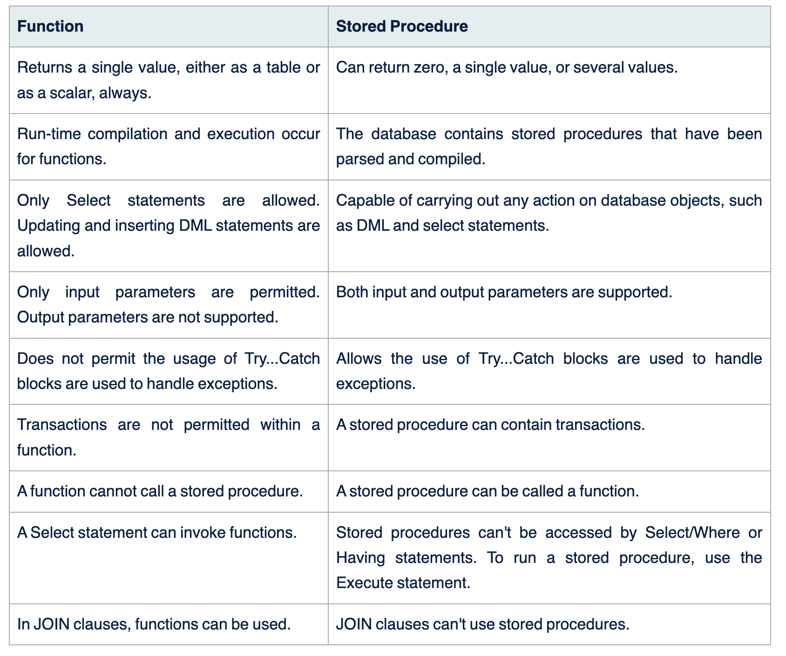

- Subqueries In Sql.
- Stored Procedure: Tập hợp các câu lệnh sql được lưu trong csdl
  - Tạo:

  CREATE PROCEDURE StoredProcedureName AS

  CREATE PROCEDURE MyStoredProcedure AS SET ROWCOUNT 10 SELECT
  Products.ProductName AS TenMostExpensiveProducts, Products.UnitPrice FROM
  Products ORDER BY Products.UnitPrice DESC
  - Chỉnh sửa:

  ALTER PROCEDURE MyStoredProcedure AS
  - Thực thi:

  EXEC MyStoredProcedure

  EXEC "My Stored Procedure"

  EXEC MyStoredProcedure @ParameterName="MyParameter"
- Trigger In Sql.
- Trigger In Sql.
- Windows Function In Sql.

https://www.scholarhat.com/tutorial/sqlserver/difference-between-stored-procedure-and-function-in-sql-server#:~:text=Summary,critical%20for%20efficient%20database%20creation.

